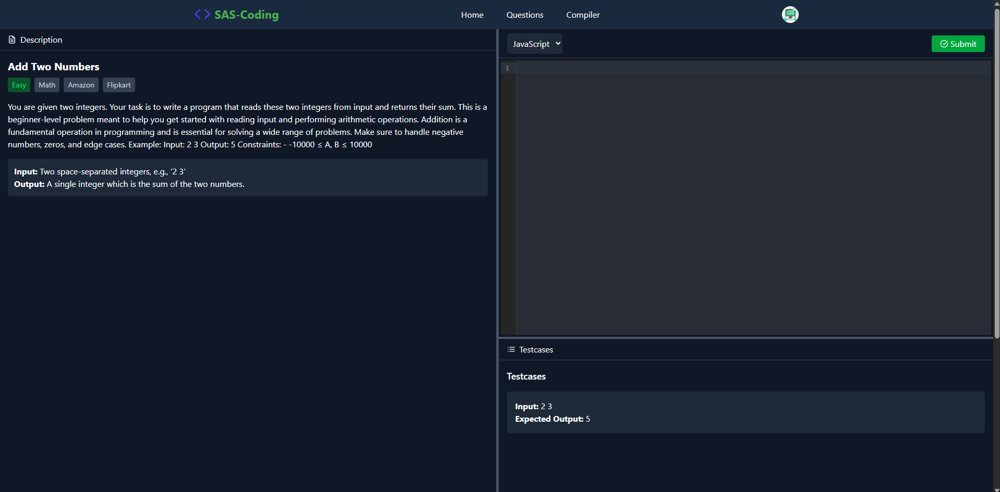

# 🧠 Code-Craft Online Compiler & AI Code Reviewer

A full-stack web application that offers:

- **Online Code Compilation**: Supports JavaScript, Python, and C++ with real-time code execution using Node.js child_process.spawn.
- **AI-Powered Code Review**: Integrates with Google's Generative AI to provide intelligent feedback on your code.
- **LeetCode-Style Question Solving**: Solve coding problems with test cases and track your progress.
- **User Authentication**: Secure login system with OTP verification.

## 🚀 Features

### 👨‍💻 Online Compiler
- **Language Support**: JavaScript, Python, and C++.
- **Custom Input**: Provide custom input for your programs.
- **Real-Time Output**: View output or errors instantly after code execution.

### 🤖 AI Code Reviewer
- **Intelligent Feedback**: Get suggestions and improvements for your code using Google's Generative AI.
- **Easy Integration**: Seamlessly integrated into the code editor interface.

### 📚 LeetCode-Style Question Solving
- **Problem Sets**: Access a variety of coding problems.
- **Test Cases**: Validate your solutions against predefined test cases.
- **Progress Tracking**: Monitor your solved questions and performance.

### 🔐 Authentication
- **OTP Verification**: Secure login using email-based OTP.
- **Session Management**: Maintain user sessions with JWT.

## 🛠️ Technologies Used

### Backend
- **Node.js & Express**: Server-side framework.
- **MongoDB & Mongoose**: Database and ODM.
- **child_process.spawn**: Executes user-submitted code securely.
- **Google Generative AI**: Provides AI-driven code reviews.
- **JWT**: Handles authentication.
- **Nodemailer**: Sends OTP emails.

### Frontend
- **React**: Frontend library.
- **CodeMirror**: Code editor component.
- **Tailwind CSS**: Utility-first CSS framework.
- **React Router**: Manages routing.
- **Axios**: Handles HTTP requests.

## 📂 Project Structure

### Backend Routes
- `POST /api/compile`: Compile and execute code.
- `POST /api/review`: Get AI feedback on code.
- `POST /api/questions/upload`: Upload new questions.
- `GET /api/questions/`: Retrieve all questions.
- `GET /api/questions/:id`: Retrieve a specific question.
- `POST /api/questions/:id/submit`: Submit solution for evaluation.
- `GET /api/questions/user/solved`: Get user's solved questions.
- `POST /api/auth/send-otp`: Send OTP to user's email.
- `POST /api/auth/verify-otp`: Verify OTP.
- `POST /api/auth/logout`: Logout user.

### Frontend Routes
- `/`: Compiler Landing Page.
- `/login`: Email Login Page.
- `/verify-otp`: OTP Verification Page.
- `/compiler`: Online Compiler.
- `/questions`: List of Questions (Protected).
- `/questions/:id`: Question Interface (Protected).

## ⚙️ Installation & Setup

### Prerequisites
- Node.js: v14 or higher
- MongoDB: Running instance
- Google API Key: For Generative AI

### Backend Setup
1. Navigate to the backend directory:
```bash
cd backend
```

2. Install dependencies:
```bash
npm install
```

3. Create a `.env` file and add the following:
```env
PORT=8000
MONGO_URI=your_mongodb_uri
JWT_SECRET=your_jwt_secret
GOOGLE_API_KEY=your_google_api_key
EMAIL_USER=your_email@example.com
EMAIL_PASS=your_email_password
```

4. Start the backend server:
```bash
npm start
```

### Frontend Setup
1. Navigate to the frontend directory:
```bash
cd leet
```

2. Install dependencies:
```bash
npm install
```

3. Create a `.env` file and add the following:
```env
VITE_BACKEND_URL=http://localhost:8000
```

4. Start the Frontend server:
```bash
npm run dev
```

## 🖼️ Screenshots
*Note:  screenshots here*





## 🎬 Demo
*Note:  demo GIF here*


## 📄 License
This project is licensed under the MIT License.

## 🙌 Contributing
Contributions are welcome! Please fork the repository and submit a pull request.

## 👤 Developer Team

Meet the people who made this project possible:

| Name | Role |
|------|------|
| Alex Johnson | Lead Developer |
| Maria Chen | Frontend Developer |
| David Rodriguez | Full Stack Developer |
| Sarah Patel | Backend Developer |
| Marcus Lee | UI/UX Developer |

## 📞 Contact
For any questions or inquiries, please reach out to us through:
- GitHub: [@yourusername](https://github.com/santanu0101)
- Email: santanuraj75@gamil.com